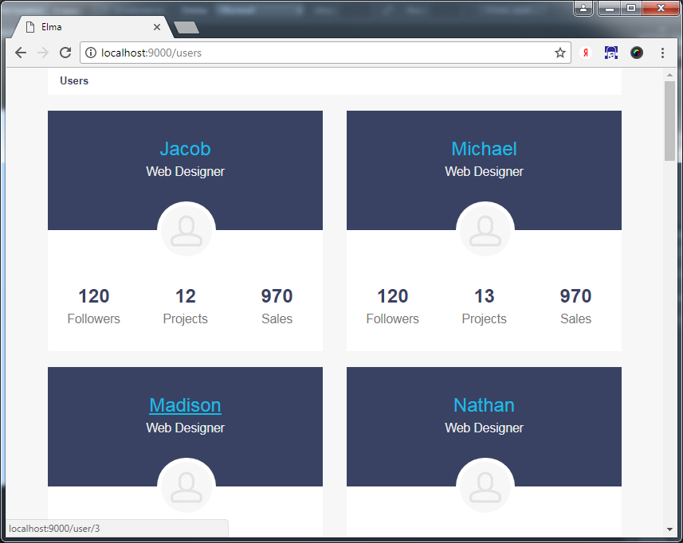
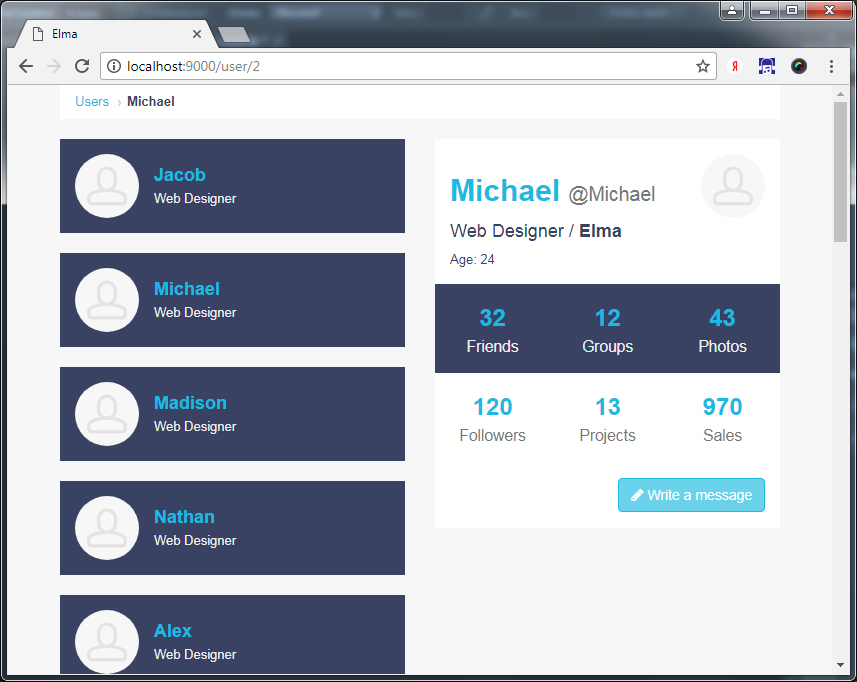
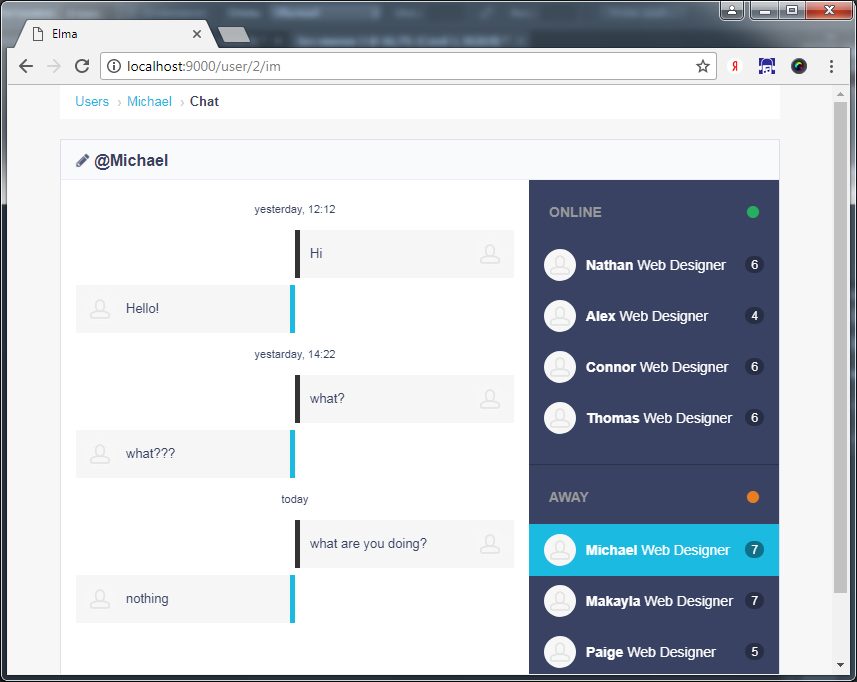

# Elma Test
Test app with angular 4


## Usage local
You need install:
* [Node.js](https://nodejs.org) and [Npm](https://www.npmjs.com/)

write in command line
```bash
git clone https://github.com/aleksnick/elma-test.git
cd elma-test
npm install -g webpack webpack-dev-server rimraf
npm install 
npm run serve
```  
Open in your browser '''http://localhost:9000/'''

## Usage in virtualbox
You need install: 
* [virtualbox](https://www.virtualbox.org/wiki/Downloads)
* [extension pack](http://download.virtualbox.org/virtualbox/5.0.40/Oracle_VM_VirtualBox_Extension_Pack-5.0.40-115130.vbox-extpack) 
* [vagrant](https://www.vagrantup.com/)

write in c:\Windows\System32\drivers\etc\hosts
```
127.0.0.1       elma.local
```  

write in command line
```bash
git clone https://github.com/aleksnick/elma-test.git
cd elma-test
vagrant up
```  
Open in your browser '''http://elma.local:9000/'''


## Screenshots

### Main


### Profile


### Chat


